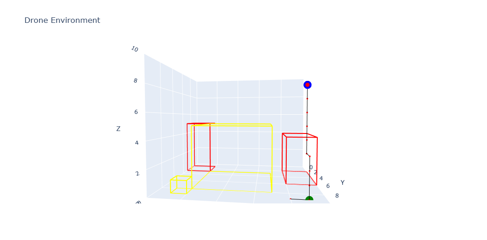

# 🚁 Drone Reinforcement Learning Project

## 📌 Overview
This project, located in the `004 Dron Game/` directory, implements and trains a reinforcement learning (RL) agent to autonomously navigate a drone in a custom 3D environment. Built using [Gymnasium](https://gymnasium.farama.org/), the project employs **Q-learning** for training and **Plotly** for interactive 3D visualizations. The agent learns to reach a goal while avoiding buildings and prohibited zones in a 3D grid.

## 📁 Directory Structure
### Root: `RL/MYRL/`
- `.gitignore`: Files ignored by Git.
- `.ipynb_checkpoints/`: Jupyter Notebook checkpoints.
- `001 Gymnasium/`: Initial Gymnasium experiments.
- `002 Q_learning/`: Core Q-learning implementation.
- `003 DQN/`: Deep Q-Network experiments.
- `004 Dron Game/`: 🚁 **Main project: environment, training, evaluation**.
- `imgs/`: Images of evaluation and training results.
- `README.md`: Documentation file.
- `requirements.txt`: Required Python packages.
- `Test_gym/`: Testing environments.

### Project Folder: `004 Dron Game/`
- `001 Create_Dron_env.ipynb`: Defines and tests the 3D drone environment.
- `002 Drone_train.ipynb`: Trains the agent with Q-learning.
- `003 Dron_Eval.ipynb`: Evaluates agent performance.
- `Drone_env.ipynb`: Reusable environment module.
- `drone_environment_render.html`: Interactive 3D visualization.
- `drone_environment_render2.html`: Alternate 3D render.

### Images: `imgs/`
- `dron_q_learn_1_eval.png`: Q-learning evaluation plot 1.
- `dron_q_learn_2_eval.png`: Q-learning evaluation plot 2.
- `dron_q_learn_3_eval.png`: Q-learning evaluation plot 3.

## 🎯 Project Goals
- ✅ Build a realistic 3D drone navigation environment.
- ✅ Implement Q-learning for 3D pathfinding.
- ✅ Visualize training and evaluation with Plotly.

## 🚀 Getting Started
### 1. Clone the Repository
```bash
git clone https://github.com/mustafataha5/your-repo.git
cd your-repo/RL/MYRL
```

### 2. Set Up the Environment
```bash
python -m venv drone_env
source drone_env/bin/activate  # On Windows: drone_env\Scripts\activate
pip install -r requirements.txt
```

### 3. Run the Notebooks
Navigate to `004 Dron Game/` and open the notebooks in order:
- `001 Create_Dron_env.ipynb`
- `002 Drone_train.ipynb`
- `003 Dron_Eval.ipynb`

### 4. View Results & Visualizations
- **Static Plots**: Available in the `imgs/` folder.
- **3D Visuals**: Open `drone_environment_render.html` or `drone_environment_render2.html` in your browser.

#### 📷 Example Evaluation Plots




> Ensure images are committed or use hosted URLs.

## 🧪 Features
- Custom 3D drone environment with obstacles and goals.
- Tabular Q-learning agent.
- Gymnasium-compatible training pipeline.
- Interactive 3D visualizations with Plotly.
- Includes collision detection and reward shaping.

## ⚙️ Dependencies
Install using:
```bash
pip install -r requirements.txt
```
Key packages include:
- `gymnasium`
- `numpy`
- `plotly`
- `jupyter`

## 🧩 Contributing
1. Fork the repository.
2. Create a new branch: `git checkout -b feature-name`
3. Commit changes: `git commit -m "Add feature"`
4. Push branch: `git push origin feature-name`
5. Open a pull request.

## 📜 License
This project is under the MIT License. See [LICENSE](LICENSE) for details.

## 📬 Contact
Created by **Mustafa Taha**  
📧 Email: mustafa.taha.mu95@gmail.com  
📍 Location: Ramallah, Palestine  
💼 GitHub: [mustafataha5](https://github.com/mustafataha5)

## ⭐ Acknowledgments
- [Gymnasium](https://gymnasium.farama.org/)
- [Plotly](https://plotly.com/)
- Reinforcement Learning community

> *“Teach the drone to learn, and it will fly to its goal forever.”*
