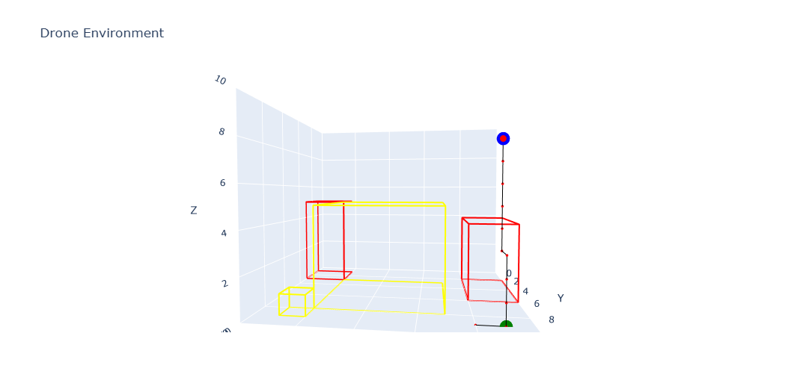
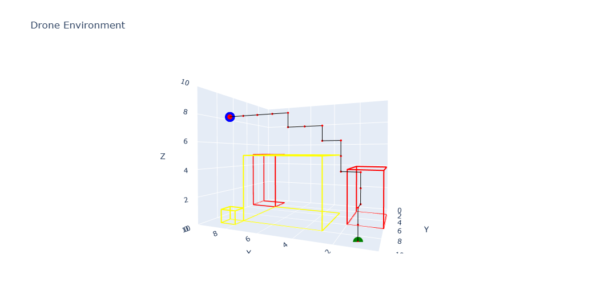

# 🚁 Drone Reinforcement Learning Project

## 📌 Overview
This project, located in the `004 Dron Game/` directory, implements and trains a reinforcement learning (RL) agent to autonomously navigate a drone in a custom 3D environment. Built using [Gymnasium](https://gymnasium.farama.org/), the project employs **Q-learning** for training and **Plotly** for interactive 3D visualizations. The agent learns to reach a randomly generated or fixed goal position while avoiding buildings and prohibited zones in a 3D grid world.

## 📁 Directory Structure
### Root: `RL/MYRL/`
- `.gitignore`: Specifies files and directories to be ignored by Git.
- `.ipynb_checkpoints/`: Jupyter Notebook checkpoints.
- `001 Gymnasium/`: Experiments setting up environments with Gymnasium.
- `002 Q_learning/`: Core Q-learning implementation.
- `003 DQN/`: Early experiments with Deep Q-Networks (DQN).
- `004 Dron Game/`: 🚁 **Main project: drone environment, training, and evaluation**.
- `imgs/`: Evaluation and training result images.
- `README.md`: This documentation file.
- `requirements.txt`: Required Python packages.
- `Test_gym/`: Testing Gymnasium environments.

### Main Project: `004 Dron Game/`
- `001 Create_Dron_env.ipynb`: Defines and tests the custom 3D drone environment.
- `002 Drone_train.ipynb`: Trains the RL agent using Q-learning.
- `003 Dron_Eval.ipynb`: Evaluates the trained agent’s performance.
- `Drone_env.ipynb`: Reusable environment module.
- `drone_environment_render.html`: Interactive 3D visualization (Plotly).
- `drone_environment_render2.html`: Alternate 3D visualization.

### Images: `imgs/`
- `dron_q_learn_1_eval.png`: Evaluation plot 1 for Q-learning performance.
- `dron_q_learn_2_eval.png`: Evaluation plot 2 for Q-learning performance.
- `dron_q_learn_3_eval.png`: Evaluation plot 3 for Q-learning performance.

## 🎯 Project Goals
- ✅ Build a realistic 3D navigation environment for a drone.
- ✅ Implement Q-learning for pathfinding in 3D space.
- ✅ Visualize results with static plots and interactive 3D renders.

## 🚀 Getting Started
### 1. Clone the Repository
```bash
git clone https://github.com/mustafataha5/your-repo.git
cd your-repo/RL/MYRL
```

### 2. Set Up the Environment
```bash
python -m venv drone_env
source drone_env/bin/activate  # On Windows: drone_env\Scripts\activate
pip install -r requirements.txt
```

### 3. Run the Notebooks
Navigate to `004 Dron Game/` and open the notebooks in order:
- `001 Create_Dron_env.ipynb`: Define the 3D environment.
- `002 Drone_train.ipynb`: Train the agent with Q-learning.
- `003 Dron_Eval.ipynb`: Evaluate and visualize the trained agent.

### 4. View Results & Visualization
- **Static Evaluation Plots**: View performance metrics below or in the `imgs/` directory (if committed to the repository).
- **Interactive 3D Render**: Open `drone_environment_render.html` or `drone_environment_render2.html` in a browser, or visit [GitHub Pages link] (replace with your hosted URL if available) to explore drone movement in 3D.

#### 📷 Static Evaluation Plots
Example performance of the trained drone agent:

<!--  -->



*Note*: For `dron_q_learn_2_eval.png` and `dron_q_learn_3_eval.png`, ensure they are committed to the `imgs/` directory or replace with external URLs (e.g., Google Drive links).

## 🧪 Features
- Custom `DroneEnvironment` with 3D grid, obstacles, and goal zones.
- Tabular Q-learning agent for navigation.
- Gymnasium-compatible training and evaluation pipeline.
- Interactive 3D visualizations using Plotly.
- Reward shaping, early termination, and collision detection.

## ⚙️ Dependencies
Install dependencies from `requirements.txt`:
```bash
pip install -r requirements.txt
```
Key packages include:
```bash
pip install gymnasium numpy plotly jupyter
```

## 🧩 Contributing
Contributions are welcome! To contribute:
1. Fork the repository.
2. Create a new branch: `git checkout -b feature-name`.
3. Make changes and commit: `git commit -m "Add new feature"`.
4. Push to the branch: `git push origin feature-name`.
5. Submit a pull request.

## 📜 License
This project is licensed under the MIT License. See the [LICENSE](LICENSE) file for details.

## 📬 Contact
Created by Mustafa Taha  
📧 Email: mustafa.taha.mu95@gmail.com  
📍 Location: Ramallah, Palestine  
💼 GitHub: [mustafataha5](https://github.com/mustafataha5)

## ⭐ Acknowledgments
- [Gymnasium](https://gymnasium.farama.org/) for environment interfaces.
- [Plotly](https://plotly.com/) for 3D visualizations.
- Reinforcement Learning community and tutorials.

> *“Teach the drone to learn, and it will fly to its goal forever.”*